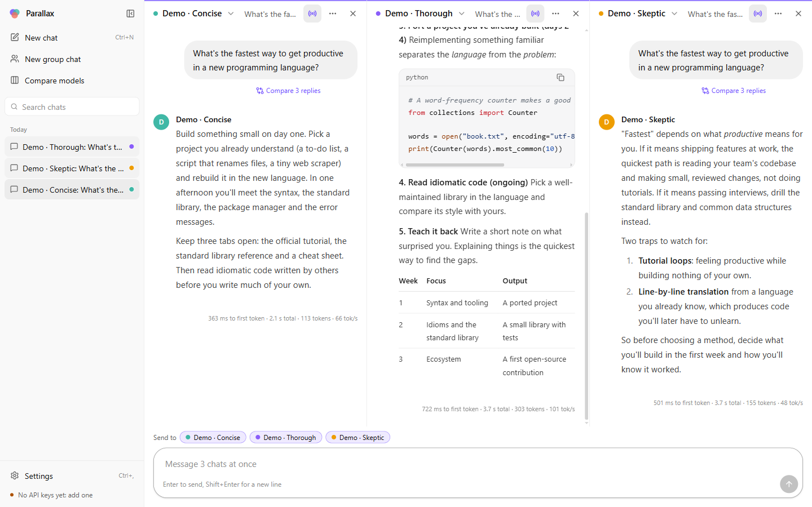
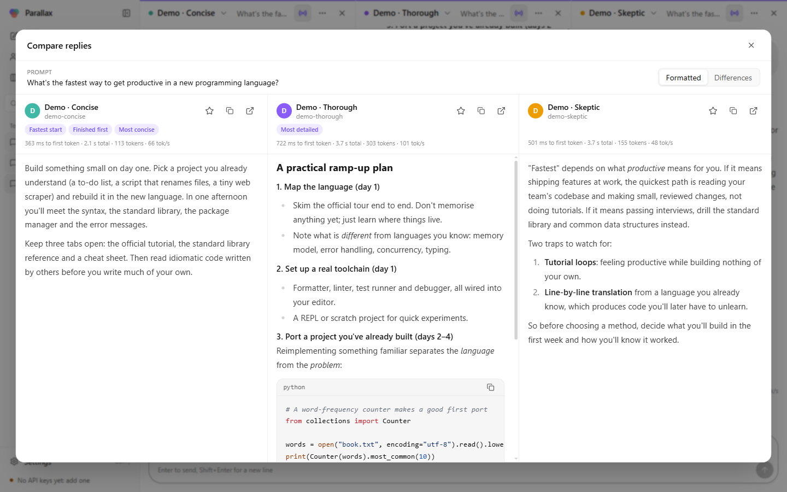
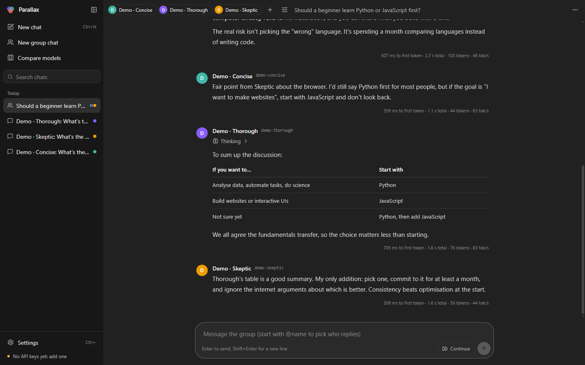
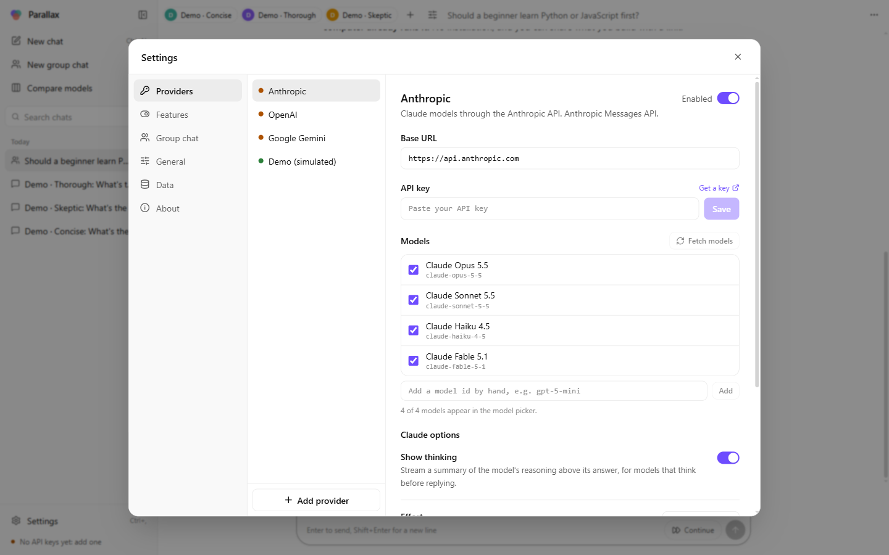
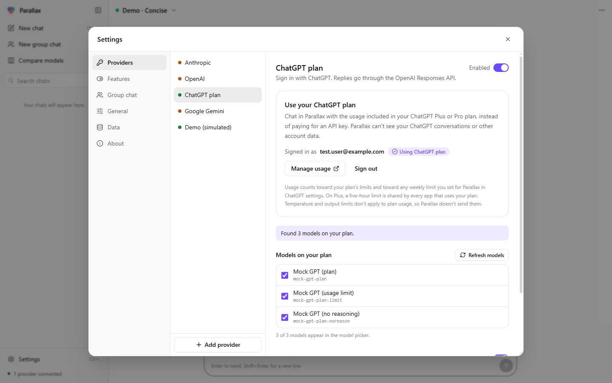
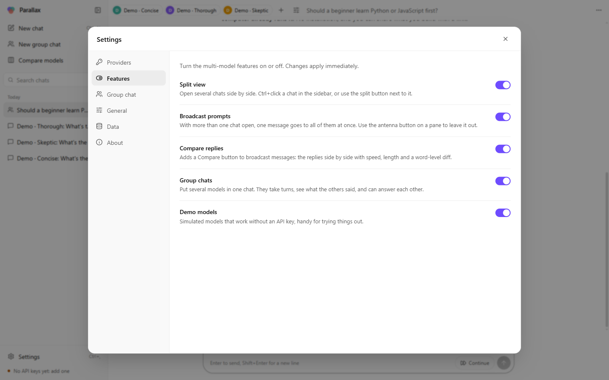

<div align="center">


# Parallax

**One prompt, many models.** A desktop chat app for Claude, GPT, Gemini and any OpenAI-compatible model.
Run several chats side by side, send one prompt to all of them, compare the answers, or put several models
in a single group chat and let them talk to each other.

[Download for Windows](https://github.com/Houchen181/parallax/releases/latest) ·
[Try it in your browser](https://houchen181.github.io/parallax/) ·
[Add it to Claude or Codex](#use-parallax-in-claude-and-codex) ·
[Report an issue](https://github.com/Houchen181/parallax/issues)

</div>



## Features

- **Bring your own key, any provider.** Anthropic (Claude), OpenAI (GPT), Google Gemini, OpenRouter, Groq,
  DeepSeek, Mistral, xAI, Together, local models through Ollama or LM Studio, and any server that speaks the
  OpenAI Chat Completions or Anthropic Messages API.
- **Or use your ChatGPT plan.** In the desktop app, **Continue with ChatGPT** lets ChatGPT Plus and Pro
  subscribers chat on their plan's usage instead of an API key.
- **Split view.** Open up to six chats next to each other, each with its own model and history.
- **Broadcast.** With several chats open, one message goes to all of them at once. A pane's antenna button
  takes it out of the broadcast.
- **Compare.** Every broadcast prompt gets a *Compare* button that shows the replies side by side. The view
  marks the fastest start, the first to finish, and the most detailed and most concise answers, and can show
  a word-level diff against any reply.
- **Group chat.** Put several models in one conversation. They take turns, read what the others said, and can
  build on it or disagree. You choose how many rounds follow each message, the speaking order and a persona
  for each model. Start a message with `@name` to hear from specific models only.
- **Everything is optional.** Each of these features can be turned off in Settings → Features.
- **A plugin for Claude and Codex.** Ask several models at once, or let them debate, from inside Claude Code,
  Claude Desktop or Codex. See [Use Parallax in Claude and Codex](#use-parallax-in-claude-and-codex).
- **A familiar chat UI.** Streaming Markdown, syntax-highlighted code with copy buttons, LaTeX math, Claude's
  thinking summaries, edit-and-resend, regenerate, starred replies, reply stats (time to first token, total
  time, tokens, speed), light and dark themes, and JSON export and import.
- **Demo models.** Three simulated models let you try everything before you add a key.

| Comparing replies | A group chat |
|---|---|
|  |  |

<details>
<summary>Settings: providers, ChatGPT plan and feature toggles</summary>





</details>

## Install

### Windows desktop app

Download `Parallax-Setup-<version>.exe` from the
[latest release](https://github.com/Houchen181/parallax/releases/latest) and run it. The installer isn't
code-signed yet, so Windows SmartScreen may warn you. Choose **More info → Run anyway**.

### Web version

Open <https://houchen181.github.io/parallax/>. It's the same app running in the browser.

- Keys are stored in that browser's local storage and sent straight to each provider.
- Some providers don't accept requests from web pages (CORS), so they only work in the desktop app or the local
  web version below.
- Local servers such as Ollama need their own CORS setting (for Ollama, `OLLAMA_ORIGINS`).
- Sign in with ChatGPT isn't available on the hosted site: OpenAI only allows it for apps that run on your own
  computer. Use the desktop app, or run the web version locally.

### Run the web version on your computer

This runs Parallax in your browser, served from your own computer. Because it then counts as a local app, it
gets the same powers as the desktop app:
- **Sign in with ChatGPT** works.
- Every provider works, including ones that block web pages.
- API keys stay out of the browser.

You need [Node.js](https://nodejs.org) 22 or newer.

```bash
git clone https://github.com/Houchen181/parallax.git
cd parallax
npm install
npm run serve
```

Parallax opens at <http://127.0.0.1:4747/>.

- A small local server keeps your API keys and ChatGPT sign-ins in a file only your user account can read: on
  Windows `%APPDATA%\Parallax Local`, on macOS `~/Library/Application Support/Parallax Local`, on Linux
  `~/.config/parallax-local`. It also passes requests from the page to the providers.
- The server only listens on `127.0.0.1`. It accepts requests only from the page it served, which carries a
  session token that changes on every start, so other websites you visit can't use it.
- Your chats are stored in the browser for that address. Use the same port every time (`--port` changes it) to
  keep them.
- Stop it with Ctrl+C. Start it again later with `npm run serve`.

## Getting started

1. Open **Settings → Providers**, pick a provider and paste your API key. Parallax fetches that provider's
   model list automatically. To add another provider, click **Add provider** and choose one of the presets.
   With a ChatGPT Plus or Pro plan, you can instead pick **ChatGPT plan** and click **Continue with ChatGPT**
   (desktop app or local web version).
2. Start a chat with **New chat** and pick a model at the top of the pane.
3. To compare models, click **Compare models**, tick the models you want and type a question. Each model gets
   its own pane, and your messages go to all of them.
4. For a group chat, click **New group chat**. Use the **+** button to add models and the sliders button to
   set the rounds and the speaking order.

Keyboard shortcuts:

- **Ctrl+N**: new chat
- **Ctrl+Shift+N**: new group chat
- **Ctrl+B**: show or hide the sidebar
- **Ctrl+,**: open Settings
- **Esc**: stop generating

**Ctrl+click** a chat in the sidebar to open it beside the current one.

### Using a subscription instead of an API key

- **ChatGPT Plus or Pro: yes, in the desktop app or the [local web version](#run-the-web-version-on-your-computer).**
  Parallax supports OpenAI's
  [Sign in with ChatGPT plan usage](https://developers.openai.com/siwc/token-sharing-open-source) for
  open-source, locally run apps.
  - The hosted website can't offer it: OpenAI requires approval and a server for hosted sites, and that path is
    currently limited to selected partners.
  - Chats with the "ChatGPT plan" models count toward your plan's limits and any weekly limit you set for
    Parallax under [ChatGPT settings → Usage](https://chatgpt.com/settings/usage).
  - On Plus, the five-hour limit is shared by every app that uses your plan.
  - Parallax can't see your ChatGPT conversations or other account data.
- **Claude Pro or Max: no.** Anthropic's terms don't allow third-party apps to sign in with Claude.ai accounts
  or send requests through Free, Pro or Max plans. Use an API key from the
  [Claude Console](https://console.anthropic.com/settings/keys) instead.

## Use Parallax in Claude and Codex

Parallax also comes as a plugin for Claude Code, Claude Desktop and Codex. Your assistant can then get a
second opinion from other models, compare their answers or let them argue a question out, without you leaving
the chat. For example:

> Use Parallax to ask GPT-5 and Gemini to review this function, then tell me where they disagree.

The plugin adds five tools:

| Tool | What it does |
|---|---|
| `ask_models` | Sends one prompt to several models in parallel and returns every answer |
| `group_discussion` | Has the models take turns replying to each other for a few rounds |
| `list_models` | Shows which providers are set up and the models they offer |
| `get_results` | Collects answers that were still coming in when a call returned |
| `configure_keys` | Opens a page in your browser where you add, test or remove API keys |

Models are named `provider:model`, such as `anthropic:claude-opus-5-5` or `openai:gpt-5`. The other models only
see the prompt your assistant writes for them, not your conversation.

Claude Code and Codex start the plugin with [Node.js](https://nodejs.org), so you need version 20 or newer on
your PATH. Claude Desktop runs it with its own built-in Node.js.

### Claude Code

In Claude Code (including the Code tab of the Claude desktop app), run:

```text
/plugin marketplace add Houchen181/parallax
/plugin install parallax@parallax
```

When you enable the plugin, Claude Code asks for API keys for Anthropic, OpenAI, Google Gemini and OpenRouter.
All of them are optional, and they're stored in your system's secure storage. To change them later, run
`/plugin configure parallax@parallax`. For other providers, use the key page (see [API keys](#api-keys)).

### Claude Desktop

1. Download `Parallax-<version>.mcpb` from the [latest release](https://github.com/Houchen181/parallax/releases/latest).
2. Open it with Claude Desktop: double-click it, or drag it onto **Settings → Extensions**.
3. Enter the API keys you want in the extension's settings. You can also add keys later from the chat.

### Codex

Add the marketplace from a terminal:

```bash
codex plugin marketplace add Houchen181/parallax
```

Then, in the Codex app, open **Plugins**, choose the **Parallax** marketplace and install the plugin. If it
doesn't appear, restart the app.

Codex has no settings screen for plugins, so ask Codex to *set up Parallax keys*. It runs `configure_keys`,
which opens the key page in your browser.

### API keys

The plugin uses your own API keys. For each provider it takes the first key it finds in this order:

1. The plugin's settings in Claude Code or Claude Desktop.
2. Keys saved on the Parallax key page (`configure_keys`). They're stored in the same file as the
   [local web version's](#run-the-web-version-on-your-computer) keys, so a key saved in one works in the other.
3. The provider's usual environment variable, such as `ANTHROPIC_API_KEY`, `OPENAI_API_KEY`, `GEMINI_API_KEY`
   or `OPENROUTER_API_KEY`. Claude Code passes your environment on to the plugin; Codex doesn't by default.

Some notes:

- Keys never go through the chat. Don't paste a key into a conversation; use the key page instead.
- Each key is only sent to its own provider.
- The desktop app's keys are encrypted for that app alone, so the plugin can't read them. Add them again on
  the key page.
- Ollama and LM Studio need no key; their models show up while those apps are running.
- Sign in with ChatGPT stays in the app. The plugin needs an OpenAI API key for GPT models.

<details>
<summary>Advanced settings (environment variables)</summary>

| Variable | Meaning |
|---|---|
| `PARALLAX_<PROVIDER>_API_KEY` | A key for one provider, e.g. `PARALLAX_XAI_API_KEY` |
| `PARALLAX_<PROVIDER>_BASE_URL` | Send that provider's requests to another address, such as a company gateway |
| `PARALLAX_DEFAULT_MODELS` | Models to ask when none are named, e.g. `anthropic:claude-opus-5-5,openai:gpt-5` |
| `PARALLAX_WAIT_SECONDS` | How long a call waits before returning the answers so far (default 45; 240 in Claude Code) |
| `PARALLAX_DATA_DIR` | Where the key page saves keys |

</details>

### Long answers

Some apps stop a tool call after about a minute, and strong models can think for longer than that. When time
runs out, Parallax returns the answers that are ready and keeps the other requests running. Your assistant then
collects the rest with `get_results`.

## Providers

| Provider | API | Notes |
|---|---|---|
| Anthropic | Messages API through the official `@anthropic-ai/sdk` | Thinking summaries, effort setting, prompt caching, refusal fallback |
| OpenAI | Chat Completions | GPT and o-series models |
| ChatGPT plan | Responses API, signed in with ChatGPT | Desktop app or local web version; uses your Plus or Pro plan, with reasoning summaries |
| Google Gemini | Gemini's OpenAI-compatible endpoint | |
| OpenRouter, Groq, DeepSeek, Mistral, xAI, Together | Chat Completions | One preset each |
| Ollama, LM Studio | Chat Completions on `localhost` | No key needed |
| Custom | Either API | Any base URL, such as vLLM, LiteLLM or a company gateway |

Notes on Claude:

- Parallax asks the newer models for a **summary of their thinking** and streams it above the answer. You can
  turn this off per provider.
- **Effort** controls how much the model thinks. It defaults to each model's own setting.
- Requests use automatic **prompt caching**, so long chats cost less.
- When a supported model (Claude Fable 5.1, Opus 5.5, Opus 5, Sonnet 5.5) declines a request for safety
  reasons, the API's **refusal fallback** retries it on Anthropic's recommended fallback model. The reply is
  labelled with the model that wrote it. This is on by default for `api.anthropic.com`; turn it off in the
  provider's settings.

## Privacy and security

- **There is no Parallax server.** Messages go directly from the app to the providers you configure.
- **Desktop app.**
  - Once saved, API keys stay in the Electron main process, encrypted with Windows DPAPI (`safeStorage`).
    The UI never gets them back, and the main process attaches them to outgoing requests itself.
  - Each key is locked to the origin it was saved for, so it can't be sent to any other host.
  - Sign in with ChatGPT happens in your own browser, with PKCE and a one-time callback on `127.0.0.1`.
    Parallax never sees your ChatGPT password.
  - ChatGPT ID tokens are verified against OpenAI's published keys. Access and refresh tokens are encrypted
    like API keys and only ever sent to `api.openai.com`.
  - Signing out revokes the session with OpenAI.
- **Local web version.** The same rules apply. The local server keeps keys and tokens in a file only your user
  account can read (as OpenAI's docs describe for open-source clients) rather than in the browser. It accepts API
  calls only from its own page.
- **Plugin.**
  - It runs on your computer as part of Claude or Codex, and sends prompts straight to the providers you use.
  - Keys from the key page live in the local web version's file.
  - The key page listens only on `127.0.0.1`, needs the one-time link that `configure_keys` opens, and never
    shows a saved key again.
- **Model output is untrusted.**
  - Raw HTML isn't rendered, and remote images become plain links (no tracking pixels).
  - Links open in your browser, not in the app.
  - A strict Content Security Policy applies.
- **Exports** contain chats, settings and the provider list, never keys.

## Development

You need Node.js 22 or newer.

```bash
git clone https://github.com/Houchen181/parallax.git
cd parallax
npm install
npm run dev        # desktop app with hot reload
```

Other commands:

| Command | What it does |
|---|---|
| `npm run serve` | Builds and runs the web version on your computer at http://127.0.0.1:4747, with Sign in with ChatGPT |
| `npm run dev:web` | The browser version at http://localhost:5173, with hot reload and no local server |
| `npm test` | Unit tests (Vitest) |
| `npm run typecheck` | TypeScript checks for the renderer, the Electron code and the plugin |
| `npm run mock` | A fake LLM server on port 8787 that speaks both APIs and fakes Sign in with ChatGPT, for testing without keys or accounts (see `scripts/mock-llm-server.mjs`) |
| `npm run dist:win` | Builds the Windows installer into `release/` |
| `npm run build:plugin` | Rebuilds the plugin's bundled MCP server, `plugins/parallax/server/parallax-mcp.cjs`. Commit the result: marketplaces install straight from this repository |
| `npm run pack:mcpb` | Builds the Claude Desktop extension into `release/` |
| `npm run icon` | Regenerates the app icon |

Project layout:

```
src/main/        Electron main process: window, encrypted key store, streaming HTTP proxy,
                 Sign in with ChatGPT (chatgpt.ts)
src/preload/     The small, typed bridge exposed to the UI
src/server/      Local web server for `npm run serve` (static files, key store, proxy, ChatGPT sign-in)
src/mcp/         The plugin's MCP server: tools, background jobs, key page. Reuses the UI's provider adapters
src/shared/      Types shared across processes
src/renderer/    React UI
  src/lib/       Provider adapters, conversation engine, prompt building, SSE parsing
  src/store/     App state (Zustand, persisted to IndexedDB)
  src/components Chat panes, composer, sidebar, compare view, settings
plugins/parallax Plugin package for Codex (and the files Claude Code installs)
.claude-plugin/  Claude Code marketplace; its entry holds the plugin's Claude Code manifest
.agents/plugins/ Codex marketplace
mcpb/            Claude Desktop extension manifest
scripts/         Dev runner, build helpers, mock server, icon generator
```

### Releasing

Push a tag such as `v0.4.0`. GitHub Actions builds the installer and the Claude Desktop extension on Windows
and attaches both to the release. Every push to `main` runs the tests, checks that the committed plugin bundle
is up to date, and deploys the web version to GitHub Pages.

## License

[MIT](LICENSE)
